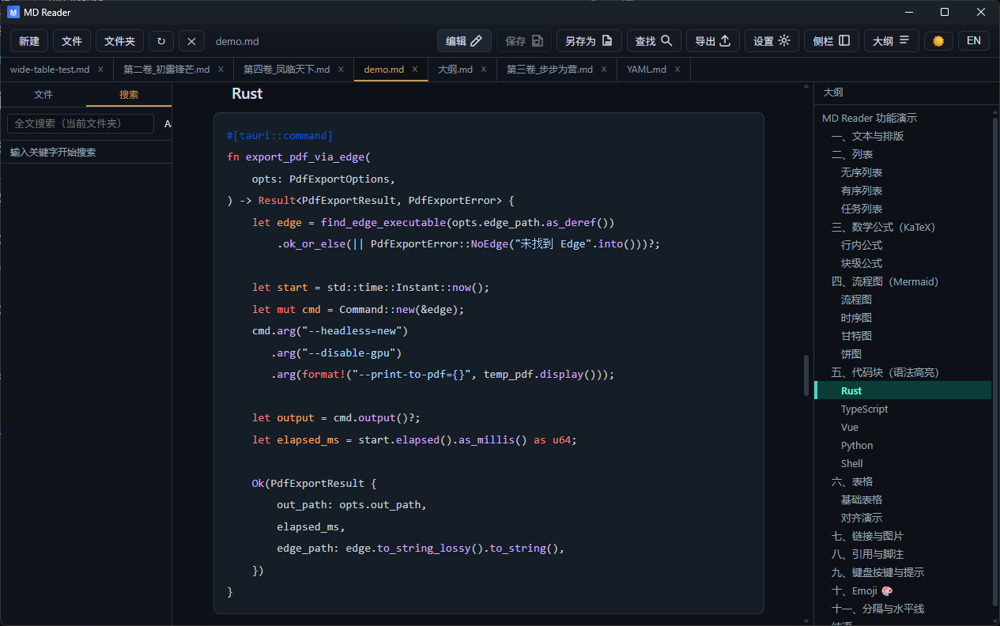
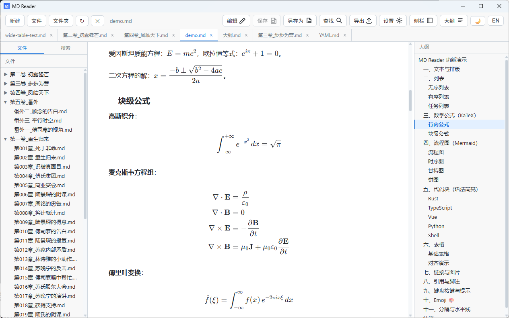

# MD Reader

**English** | [简体中文](README.md)

[](https://github.com/Neilooo/md-reader/releases)
[](LICENSE)
[](https://github.com/Neilooo/md-reader/releases)
[-lightgrey)]()

A lightweight, fast, WYSIWYG **Markdown viewer / reader / editor** desktop app. Built with **Tauri 2 + Vue 3 + Rust**.

Small footprint (~5 MB), fast startup, multi-tab editing, source editing, KaTeX math, Mermaid diagrams, syntax highlighting, file tree, full-text search, and high-fidelity PDF/HTML/DOCX export.

📦 **[Download the latest release](https://github.com/Neilooo/md-reader/releases/latest)**

---

## Features

### Multi-tab
- Open multiple Markdown files at once, switch via the horizontal tab bar under the toolbar
- Click to switch, middle-click to close; reopening an already-open file focuses its tab instead of duplicating
- Each tab independently keeps its content, unsaved draft, edit/preview mode, outline, and scroll position
- Restores the last open tabs and active tab on restart

### Reading
- CommonMark + GitHub Flavored Markdown
- YAML Front Matter parsing & preview: top `---` metadata renders as an info card, body and outline strip the metadata
- Syntax highlighting with highlight.js (30+ languages)
- Math formulas with KaTeX (lazy-loaded)
- Diagrams / sequence / mindmap with Mermaid (lazy-loaded, SVG sanitized via DOMPurify)
- Task lists, footnotes, emoji, heading anchors
- Light / dark theme with persisted preference

### Editing
- CodeMirror source editing mode with Markdown highlighting, line numbers, folding, bracket matching, find/replace, and go to line
- One-click preview / edit switch (`Ctrl+/`), with viewport synced by source line on toggle
- Markdown formatting shortcuts: `Ctrl+B` bold, `Ctrl+I` italic, `Ctrl+U` underline, `Ctrl+L` highlight, `` Ctrl+Shift+` `` inline code
- Manual save / save as with unsaved-change protection for tab switches, tab close, window close, and external file changes

### Navigation
- File tree for Markdown folders
- Outline / TOC with scroll sync
- Resizable three-column layout
- Internal Markdown links: `[text](./other.md#heading)`
- Relative image path rewriting

### Search
- `Ctrl+F` find in current document
- `Ctrl+Shift+F` full-text search across files (Rust backend)

### Export
- **PDF**: Edge headless, 1-3 seconds, WYSIWYG, no LaTeX required
- **HTML**: self-contained single file with images/CSS embedded
- **DOCX**: powered by pandoc

### Desktop integration
- Reading settings: font size, line height, width, font family
- File watching with auto refresh
- Recent files and per-file scroll position restore
- File association for `.md / .markdown / .mdx`; settings page can register per-user file associations (works for the portable build too)
- Single-instance behavior: opening another file reuses the existing window
- Drag and drop files into the window
- UI language switch: Chinese / English

## Keyboard Shortcuts

| Shortcut | Action |
|---|---|
| `Ctrl+/` | Toggle preview / edit mode |
| `Ctrl+B` | Bold (edit mode) |
| `Ctrl+I` | Italic (edit mode) |
| `Ctrl+U` | Underline (edit mode) |
| `Ctrl+L` | Highlight (edit mode) |
| `` Ctrl+Shift+` `` | Inline code (edit mode) |
| `Ctrl+F` | Find in current document; editor search in edit mode |
| `Ctrl+H` | Replace in edit mode |
| `Ctrl+G` | Go to line in edit mode |
| `Ctrl+Shift+F` | Full-text search |
| `Ctrl+N` | New Markdown file |
| `Ctrl+,` | Reading settings |
| `Ctrl+S` | Save current file |
| `Ctrl+Shift+S` | Save as |
| `Ctrl+P` | System print / Save as PDF |
| `Esc` | Close find/settings/dialogs |

## Screenshots





## Installation

### Windows (official)

Download from the [Releases page](https://github.com/Neilooo/md-reader/releases/latest):

| File | Description |
|---|---|
| `MD-Reader-*-windows-x64-setup.msi` | Installer with file association support |
| `MD-Reader-*-windows-x64-portable.exe` | Portable executable, no registry changes |

> Windows 10 / 11 usually includes WebView2 Runtime. Older Windows 10 builds may need the [Microsoft WebView2 Runtime](https://developer.microsoft.com/microsoft-edge/webview2/).

### macOS / Linux (experimental)

macOS and Linux builds are **experimental**, produced via GitHub Actions on release tags and attached to the [Releases page](https://github.com/Neilooo/md-reader/releases). They are not code-signed:

- macOS: download `.dmg` or `.app.tar.gz`
- Linux: download `.AppImage` / `.deb` / `.rpm`

> Unsigned builds: on macOS, right-click → Open on first launch, or run `xattr -dr com.apple.quarantine "MD Reader.app"`; on Linux, `chmod +x` the AppImage first.

## External Dependencies

Core reading and editing features require **no external tools**. Optional features need the tools below:

| Feature | Dependency | Included on Windows 10/11 | Notes |
|---|---|:-:|---|
| Reading / editing / multi-tab / file tree / search / math / diagrams / HTML export | None | — | Works out of the box |
| **PDF export** | Microsoft Edge (Chromium) / Chrome | ✅ Edge usually included | Used for WYSIWYG PDF export |
| **DOCX export** | [pandoc](https://pandoc.org/) ≥ 2.x | ❌ | Install only if you need DOCX |
| Print | System print dialog | ✅ | Optional fallback |

### Install pandoc (DOCX export only)

```powershell
winget install --id JohnMacFarlane.Pandoc -e
```

Or download it from [pandoc.org/installing.html](https://pandoc.org/installing.html). Restart MD Reader after installing pandoc.

> PDF / HTML export does **not** require pandoc.

## Development

### Requirements

| Tool | Version | Install |
|---|---|---|
| Node.js | ≥ 18 | https://nodejs.org/ |
| pnpm | ≥ 8 | `npm install -g pnpm` |
| Rust | ≥ 1.77 | https://rustup.rs/ |
| WebView2 Runtime | — | Usually included on Windows 10/11 |
| Visual Studio Build Tools | 2019+ | `Desktop development with C++` workload |

### Commands

```bash
pnpm install
pnpm tauri dev
pnpm tauri build
pnpm lint
pnpm format
```

## Tech Stack

- **Desktop**: Tauri 2 (Rust + WebView2)
- **Frontend**: Vue 3 + TypeScript + Vite
- **Markdown**: markdown-it plugins
- **Editor**: CodeMirror 6
- **Math**: KaTeX
- **Diagrams**: Mermaid
- **Highlighting**: highlight.js
- **PDF export**: system Edge `--headless=new --print-to-pdf`
- **DOCX export**: pandoc
- **File watching**: notify + notify-debouncer-mini
- **Full-text search**: walkdir + line scanning
- **File association / single instance**: tauri-plugin-single-instance
- **i18n**: vue-i18n

## How PDF Export Works

MD Reader does not use LaTeX for PDF export.

1. The frontend clones the already-rendered DOM (KaTeX and Mermaid are already rendered)
2. Images are embedded as base64 and CSS is inlined
3. Rust writes a temporary HTML file under `%TEMP%`
4. System Edge runs in headless mode: `--headless=new --print-to-pdf=...`
5. The generated PDF is copied to the user-selected output path

Result: fast, high-fidelity, WYSIWYG PDF export in 1-3 seconds.

## FAQ

### WebView2 is missing

Install the WebView2 Evergreen Runtime from Microsoft: https://developer.microsoft.com/microsoft-edge/webview2/

### PDF export cannot find Edge

MD Reader will ask you to choose `msedge.exe`. Chrome also works if Edge is unavailable.

### DOCX export says pandoc is missing

Install pandoc and restart MD Reader.

### Does it support macOS / Linux?

Yes, but currently as experimental builds. The official release targets Windows; macOS / Linux can be built via GitHub Actions yourself (see Installation above). These experimental builds are not code-signed.

## License

MIT
